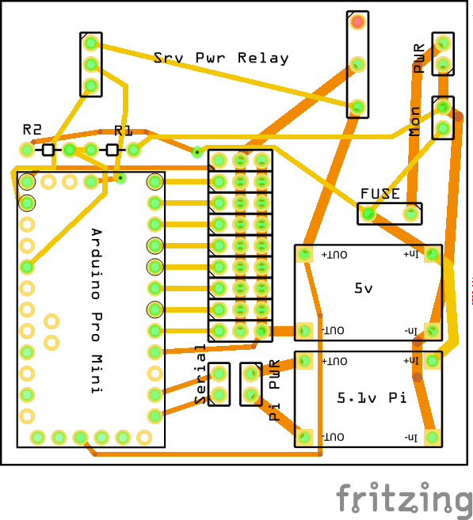

# Robotics Development Environment
This platform has been created to allow modular development and experimentation of robotics in python / C++ using the Raspberry Pi and Arduino.

## Installation
```
chmod 777 install.sh
./install.sh
```

Disable audio (see Neopixels section below)

## Running
```
./startup.sh
```

## Features

### Facial detection and tracking
Using the Raspberry Pi camera

### Servo control
Control of up to 9 servos via an arduino serial connection

### Battery monitor
Both external and software integrated via the arduino serial connection

### Auto boot & shutdown
Add the startup command to the boot file on the pi (edit `/etc/rc.local`)
This can then be stopped by running the `./stop.sh` command in the project directory.

GPIO 26 is also wired to allow shutdown when brought to ground via a switch.
Example script:
https://howchoo.com/g/mwnlytk3zmm/how-to-add-a-power-button-to-your-raspberry-pi

### Buzzer
A buzzer is connected to GPIO 27 to allow for tones to be played in absence of audio output (see Neopixel below).
https://github.com/gumslone/raspi_buzzer_player.git

### Motion Sensor
An RCWL-0516 microwave radar sensor is equipped on GPIO 13

### Stereo MEMS Mics
GPIO 18, 19 and 20 allow stereo MEMS microphones as audio input
```
Mic 3V to Pi 3.3V
Mic GND to Pi GND
Mic SEL to Pi GND (this is used for channel selection, connect to either 3.3V or GND)
Mic BCLK to BCM 18 (pin 12)
Mic DOUT to BCM 20 (pin 38)
Mic LRCL to BCM 19 (pin 35)
```
https://learn.adafruit.com/adafruit-i2s-mems-microphone-breakout/raspberry-pi-wiring-test

### Voice Recognition
Trigger word for voice recognition:
https://snowboy.kitt.ai/

### Serial communication with Arduino

In order to use the Raspberry Pi’s serial port, we need to disable getty (the program that displays login screen)

`sudo raspi-config ->  Interfacing Options -> Serial -> "Would you like a login shell to be accessible over serial" = 'No'. Restart`

#### Connection via serial pins
Connect the Pi GPIO 14 & 15 (tx & rx) to the arduino tx & rx (tx -> rx in both directions!) via a logic level shifter, as the Pi is 3v3 and the arduino is (most likely) 5v.

####Upload to Arduino over serial pins
To upload over serial pins, press the reset button on the Arduino at the point that the IDE starts 'uploading' (after compile), otherwise a sync error will display.

### Neopixel

WS1820B support is included via the Pi GPIO pin 12. Unfortunately to support this you must disable audio on the Pi.

```
sudo vim /boot/config.txt
#dtparam=audio=on
```

This is also why the application must be executed with `sudo`

https://learn.adafruit.com/neopixels-on-raspberry-pi/python-usage

## PCBs
Prefabricated PCBs are available for this project in the `circuits` folder. This allows the connection between the core components as described above.


